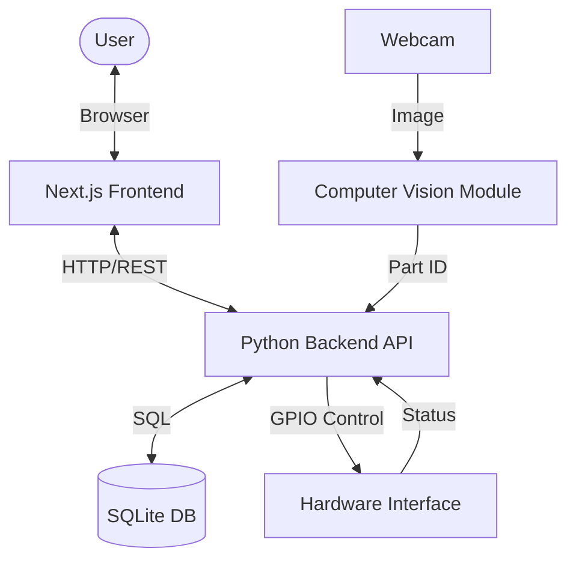

# System Architecture

## Components

### 1. The Brain (Core Logic & Database)
- **Language**: Python (FastAPI/Flask).
- **Database**: SQLite (Local file).
- **Responsibilities**:
    - Tracking Inventory.
    - Managing Box states (Empty, Filling, Full).
    - Optimization algorithms for pathfinding/retrieval.
    - Providing API for the Frontend.

### 2. The Face (User Interface)
- **Framework**: Next.js (React).
- **Hosting**: Local network (on the Pi or connected PC).
- **Responsibilities**:
    - Visualization of storage instructions.
    - User input for Retrieval requests.

### 3. The Eyes (Computer Vision Service)
- **Input**: Video stream / Still images from Webcam.
- **Processing**: Python (OpenCV) + ML Model.
- **Output**: JSON `{ "part_id": "3001", "color": "Blue", "confidence": 0.95 }`.

### 4. The Body (Hardware Interface)
- **Controller**: Raspberry Pi.
- **Library**: `RPi.GPIO` or `gpiozero` (Python).
- **Actuators**:
    - Conveyor Belt Motor.
    - Sorting/Dispensing Servo.
    - Gantry/Carousel Motor (for box movement).
- **Note**: Will need a Mock layer for development on non-Pi Windows machines.

## Data Flow

